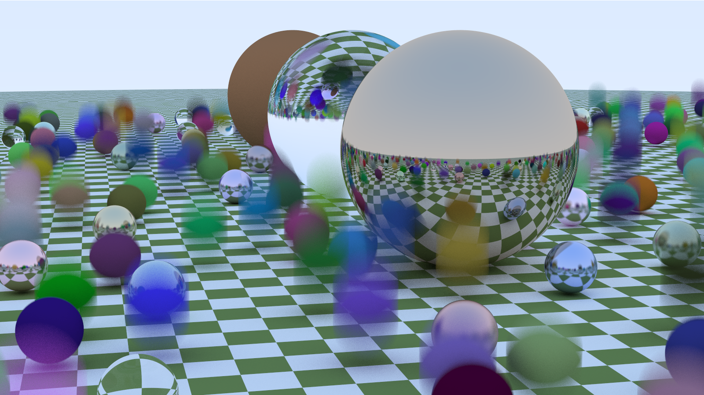

# gort
[](https://goreportcard.com/report/github.com/Erdk/gort)

Simple ray tracer written in Go.




## Instalation

```
go get github.com/Erdk/gort
cd $GOPATH/src/github.com/Erdk/gort
dep ensure
go build .
./gort -h
```

## Rationale

Gort started as my "pet project" I'm working on in my spare time, 
and I belive it'll stay this way for now, so please don't expect 
regular updates ;) The idea came to my  mind after seeing Peter 
Shirley's books on Amazon about ray-tracing: "Ray Tracing in One Weekend", 
"Ray Tracing: The Next Week" and 
 "Ray Tracing: The Rest of Your Life". I thought that this would be a 
 good way to improve my programming skills and learn more about Golang
 ecosystem and best practises. Soo.. here we are :) As for books I 
 highly recommend them, they're well written and quite easy to understand.

## Options

```
    -w <width>
        Width of generated image, by default 640.
    -h <height>
        Height of generated image, by default 480.
    -s <samples-per-pixel>
        Number of rays per pixel, by default 400.
    -t <threads>
        Number of parallel rendering jobs, by default 1. Set 0 for auto (max CPU threads).
    -o <output-file>
        Filename (without extension) of png with output, by default "output".
    -i <input-file>
        Filename of input file, if this flag is used then scene won't be randomly generated. By default empty.
    -j <save-scene>
        Save genereated scene before render to <output>.json, by default false.
    -prof <profile>
        Generate profiling profile to use with 'go tool pprof'. By default none (no profiling). Available profiles:
        - cpu 
        - mem
        - block
    -p
        If present it'll show progress (in %).
    -cu AxB
        Compute unit, number of patch to compute at once by goroutine, by default 16x16.
```

## Licenses of used materials

### Dragon model (static/dragon.obj)
License: [CC Attribution-NonCommercial](https://creativecommons.org/licenses/by-nc/4.0/)

Author: [3D Graphics 101](https://sketchfab.com/3dgraphics)

Source: https://sketchfab.com/3d-models/stanford-dragon-vrip-b602a35846e74533b1d9f06034a3b730

From the author: 
> Dragon Source/credit: Stanford University Computer Graphics Laboratory Scanner: Cyberware 3030 MS + spacetime analysis Number of scans: ~70 Total size of scans: 2,748,318 points (about 5,500,000 triangles) Reconstruction: vrip (conservatively decimated).

### HDR panorama (static/HDR_040_Field_Bg.jpg)
License [Creative Commons Attribution 3.0 Unported License.](http://creativecommons.org/licenses/by/3.0/)

Author: n/a

Source: https://www.hdri-hub.com/hdrishop/freesamples/freehdri/item/116-hdr-040-field-free